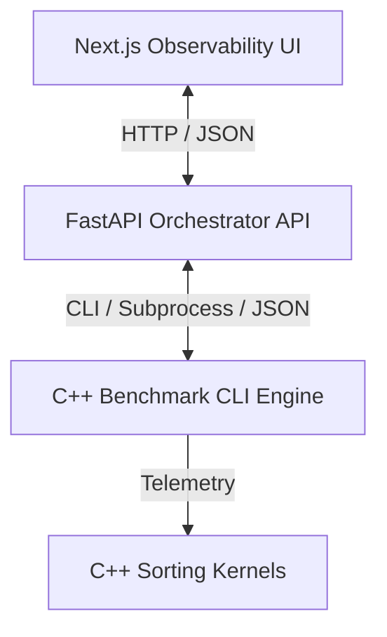

# System Architecture: Hybrid Sorting & Telemetry Toolkit

The **Hybrid Sorting & Telemetry Toolkit** is designed as a modular, full-stack observability platform for analyzing the execution dynamics of hybrid sorting algorithms. It separates high-performance kernel execution (C++) from API orchestration (Python) and rich data visualization (Next.js).

---

## Component Layout

The system is split into three distinct layers:



### 1. C++ Core Sorting Kernels & CLI Engine (`core/`)
* **Sorting Kernels (`core/introsort/`, `core/quick_insertion/`, `core/quick_merge/`, `core/quick_heap/`)**:
  These directory structures house the C++ implementations of the hybrid algorithms. They accept a configuration (`SortConfig`) and dynamically track sorting metrics using a telemetry class (`SortTelemetry`).
* **Dataset Generators (`core/datasets/`)**:
  Builds synthetic data models on demand (uniform random, nearly sorted, reverse sorted, duplicate-heavy, and exponential/skewed distributions).
* **Benchmark Engine (`core/benchmarks/benchmark_engine.cpp`)**:
  A portable command-line tool that parses flags, instantiates arrays, runs iterations, verifies correct sorting behavior, and prints structured JSON (containing the chronological log of recursion tree splits) to stdout.

### 2. API Orchestrator (`api/`)
* Built with **FastAPI** to minimize networking latency and expose clean, interactive Swagger documentation.
* **Auto-Recompilation Layer**: On startup, the API checks for the existence of `benchmark.exe`. If the binary is missing, it dynamically compiles it from the `core/` folder using `g++` with `-O3` optimizations.
* **Subprocess Execution**: When a client requests a benchmark via `POST /api/benchmark`, the backend invokes `benchmark.exe` as a subprocess, pipe-intercepts the stdout stream, parses the JSON payload, logs the report to `results/reports/` with a unique UUID, and returns it.

### 3. Observability Dashboard (`frontend/`)
* Developed using **Next.js (App Router)** and **Tailwind CSS**.
* Replaces simple educational arrays/animations with **static recursion tree graphs** and **recharts metrics curves**.
* Reconstructs recursion split history from flat interval listings using an interval-tree reconstruction algorithm.

---

## Tail-Recursion Guard & Memory Reuse

### Stack Depth Safety
To prevent stack overflows during worst-case partition imbalances (e.g. Lomuto partition on sorted arrays), all QuickSort-based algorithms implement tail-recursion stack optimization:
```cpp
if (leftSize < rightSize) {
    quickSortUtil(arr, low, p - 1);
    low = p + 1; // Loop on the larger partition
} else {
    quickSortUtil(arr, p + 1, high);
    high = p - 1; // Loop on the larger partition
}
```
This guarantees that the call stack depth is strictly bounded at $O(\log N)$, even when partitioning degrades to $O(N^2)$ time complexity.

### Dynamic Allocation Reduction
Unlike typical implementations that allocate temporary vectors inside the merge loop, our `quick_merge` algorithm allocates a single auxiliary array once at the root level and reuses it across all recursive merges, reducing runtime allocation latency.
